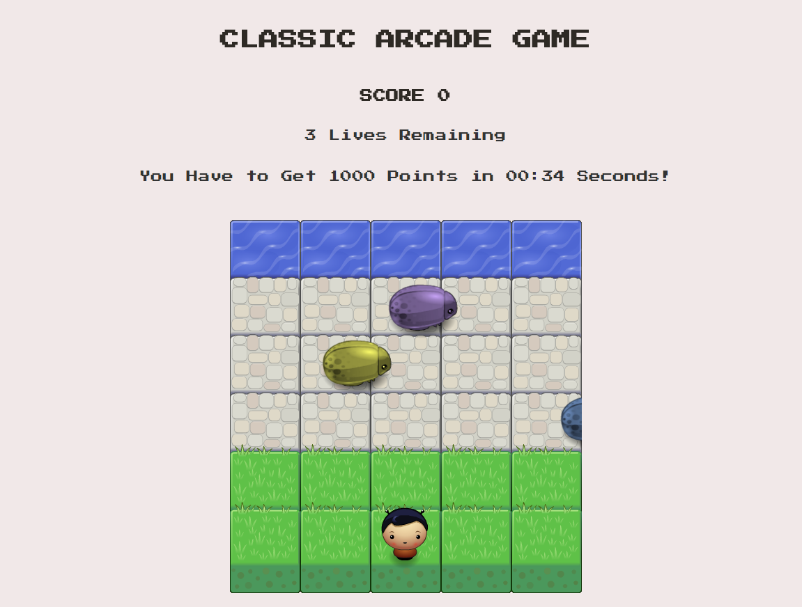
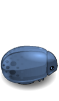
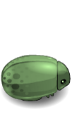
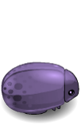
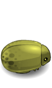
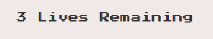

# Classic Arcade Game Clone - Udacity Project

The goal of this game is the player must reach the water, without colliding into any one of the enemies. 
The player can move left, right, up and down. The enemies move in varying speeds on the paved block. At the 
beginning of the game, the player will have three lives. The lives will be decrased by one, once the player 
collides with an enemy and the player will move back to the start square (initial location). When the remaining 
lives become zero the game will be ended. The player must have to get 1000 points in 35 seconds by reaching the
water ten times without collides with an enemy to win.

## Usage (To run)

In order to play the game properly, follow the following steps:

1- Download the .zip file.

2- Extract the .zip file.

3- Open the index.html file in your browser.

## Demo
----------------------------

### Character
----------------------------

### Enemies
----------------------------

### Score
----------------------------

### Lives
----------------------------

### Timer
----------------------------

## How to Play !
----------------------------
- Use your keyboard arrows to move the player left, right, down and up.
- Get to the water and avoid all the type of bugs.
- Save your 3 lives by avoiding bugs.
- Reach the water ten times in 35 seconds maximum to make your score 1000 points and win. 